# Lavandería El Sol

Sistema de punto de venta y gestión operativa para una lavandería real: notas de
servicio, control de máquinas, inventario, caja y reportes. Está pensado para
usarse en el mostrador desde el celular, así que toda la interfaz es *mobile
first*.

## Probarlo

**→ [lavanderia-el-sol-demo.netlify.app](https://lavanderia-el-sol-demo.netlify.app)**

Se entra con un botón, sin credenciales. Es una copia completa del sistema sobre
su propia base de datos, con notas, cortes de caja e inventario inventados por un
*seeder*: se puede crear notas, cobrar, mover inventario y cambiar la
configuración sin romper nada, y cada noche vuelve sola a su estado inicial.

La instancia que usa el negocio no se comparte, porque trabaja con datos reales
de sus clientes y de su personal. Las capturas de abajo también salen de datos
ficticios.

> La demo se apaga cuando nadie la usa, así que la primera carga puede tardar
> unos segundos mientras despiertan el servidor y la base.

## Qué hace

| | |
|---|---|
| **Notas** | Tres tipos de servicio —autoservicio, por encargo y edredón—, cada uno con su propio flujo de cobro, asignación de máquina y entrega. |
| **Máquinas** | Temporizador por lavadora y secadora, con encendido físico mediante interruptores Sonoff (Wi-Fi) e integración a la API de eWeLink. |
| **Caja** | Apertura con el fondo arrastrado del corte anterior, cobros atados a su sesión, cierre automático a medianoche y cortes congelados (un corte cerrado ya no cambia aunque se editen notas viejas). |
| **Inventario** | Productos a granel (bidón → botella → tapa), de marca y bolsas por rollo; entradas, salidas, rellenado de bidón y reporte diario de consumo. |
| **Ventas y reportes** | Corte por día, semana o rango, desempeño por empleado y exportación a PDF y CSV. |
| **Multisucursal** | Cada sucursal tiene sus máquinas, inventario, caja y notas; los ajustes del negocio son globales. |
| **Usuarios** | Roles de administrador y empleado, sesión única por usuario y registro de entrada por primer *login* del día. |

## Capturas

| Inicio de sesión | Tablero | Máquinas en ciclo |
|---|---|---|
| 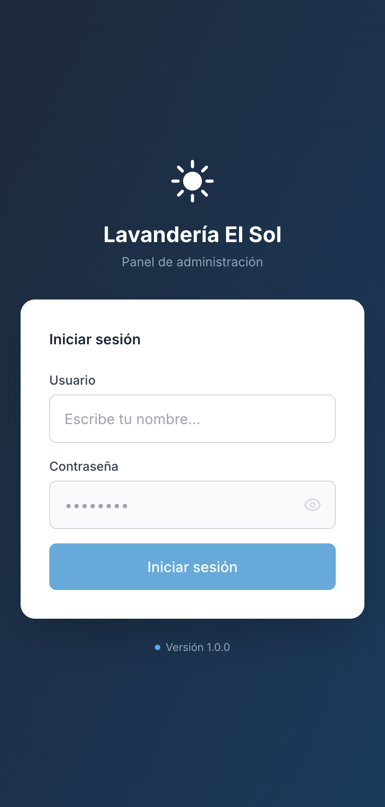 | 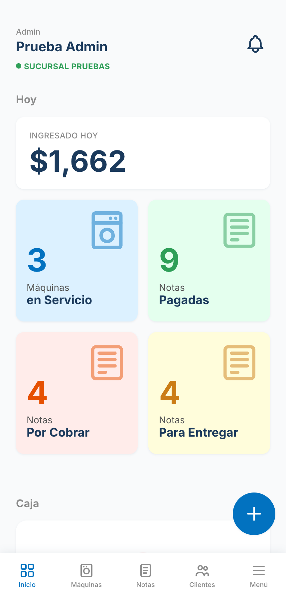 | 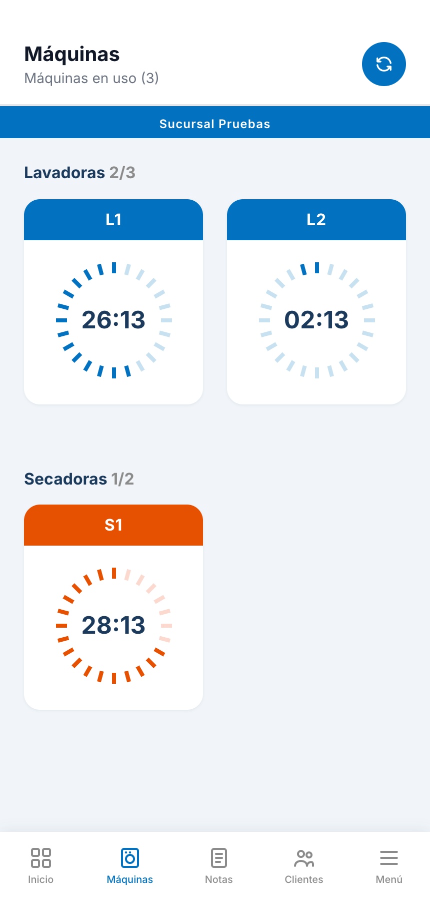 |

| Nueva nota | Listado de notas | Detalle de la nota |
|---|---|---|
| 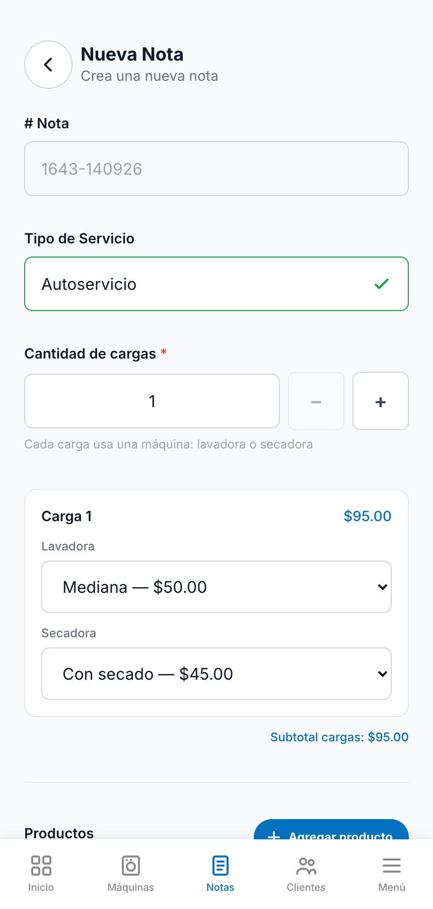 | 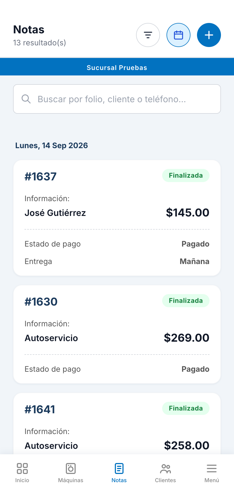 | 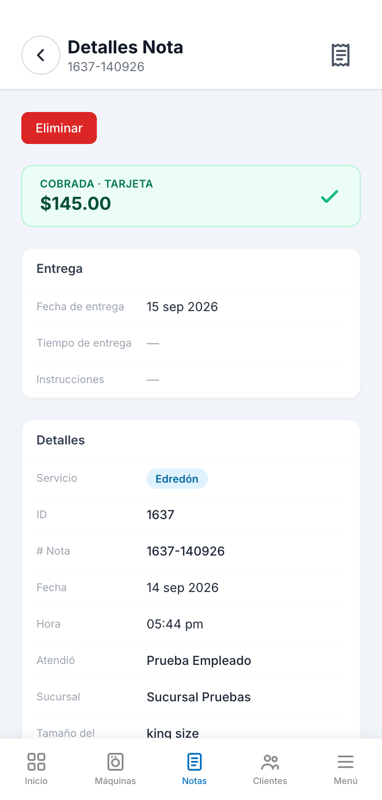 |

| Ticket para WhatsApp | Inventario | Reporte diario |
|---|---|---|
| 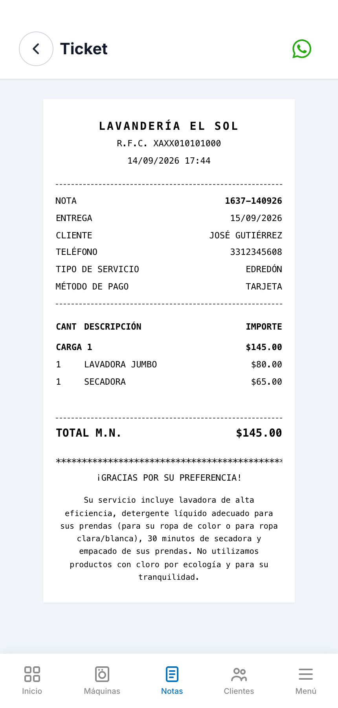 | 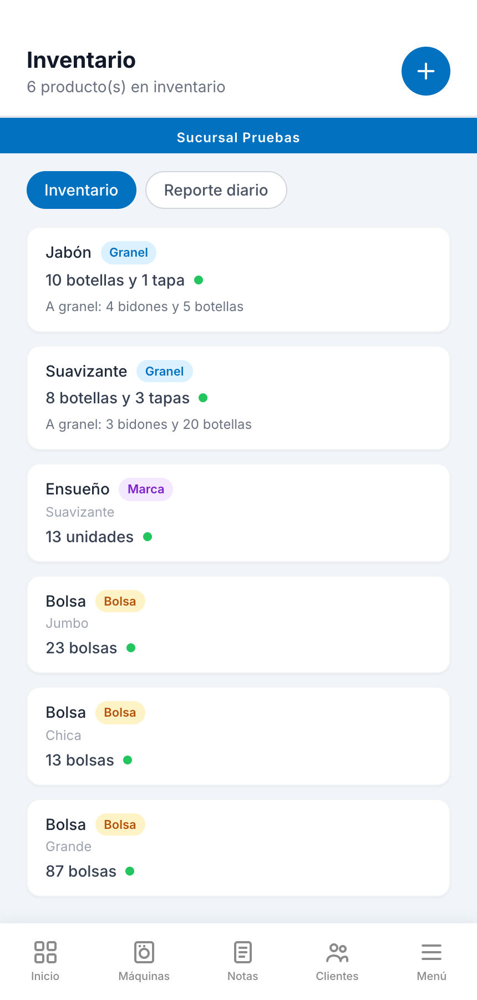 | 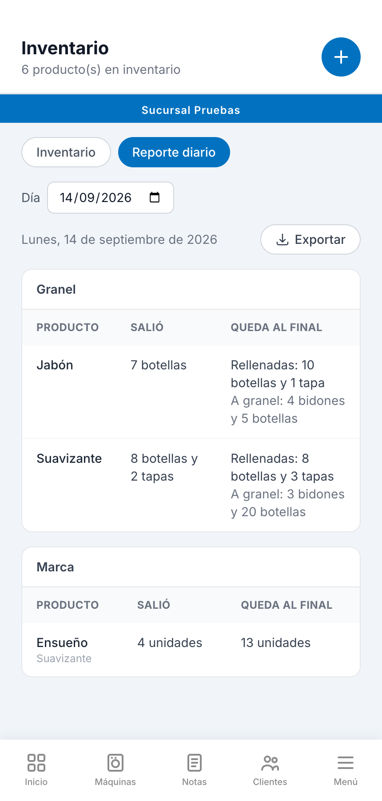 |

| Caja | Clientes |
|---|---|
| 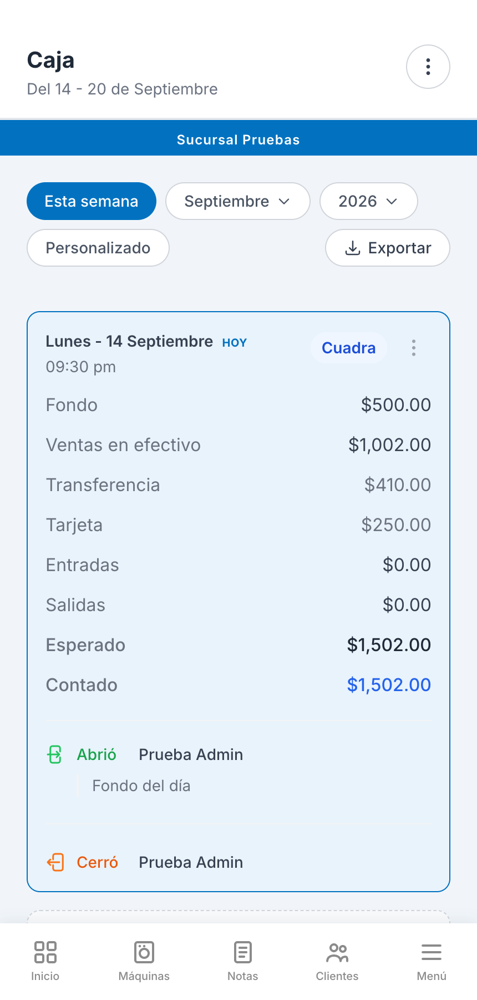 | 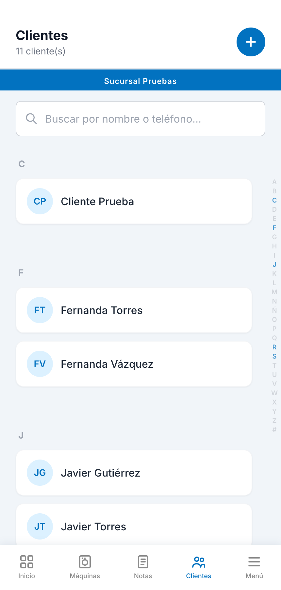 |

## Arquitectura

```
lavanderia-el-sol/
├── frontend/   React 19 + Vite + Tailwind + React Router
└── backend/    Node + Express 5 + PostgreSQL (pg)
```

**Frontend:** React 19, Vite, Tailwind CSS, React Router, Recharts para las
gráficas, `html-to-image` para generar el ticket como imagen.

**Backend:** Express 5, PostgreSQL con `pg`, autenticación JWT, `bcrypt`,
`helmet` y *rate limiting*.

**Producción:** el frontend se publica como sitio estático, el backend corre en
un contenedor con la máquina siempre encendida (el cierre del día es un trabajo
programado dentro del proceso) y la base es un PostgreSQL administrado.

## Decisiones técnicas que vale la pena mirar

- **Migraciones versionadas.** Más de cien migraciones numeradas en
  `backend/db/migrations/`, registradas en una tabla `schema_migrations` y
  aplicadas automáticamente en cada despliegue. El esquema nunca se toca a mano.
- **Aislamiento por sucursal en un solo middleware.** `sucursalActiva` resuelve
  la sucursal de cada petición; los módulos nuevos que filtran por ella quedan
  aislados sin código extra, y lo que es global se protege explícitamente.
- **Entorno de pruebas dentro de la misma app.** Una sucursal oculta con sus
  propios usuarios, máquinas e inventario permite probar contra datos reales de
  estructura sin ensuciar la operación del negocio.
- **Cortes de caja inmutables.** Un corte cerrado guarda sus totales; editar una
  nota vieja no reescribe la historia contable.
- **Integración con hardware.** Los interruptores Sonoff se controlan por la API
  de eWeLink, con un reconciliador periódico para cuando el dispositivo y la base
  se desincronizan.
- **Ticket como imagen.** WhatsApp no acepta archivos por `wa.me`, así que el
  ticket se rasteriza a PNG en el navegador y se entrega por la hoja de
  compartir del sistema.

## Pruebas

```bash
cd frontend && npm test          # 102 pruebas (Vitest + Testing Library)
cd backend  && npm run test:all  # 67 unitarias + 269 de integración
```

Las de integración levantan su propia base desechable, así que no tocan datos de
desarrollo.

## Correrlo en local

Requiere Node 20+, pnpm y PostgreSQL.

```bash
# Backend
cd backend
cp .env.example .env     # configurar conexión a Postgres y JWT_SECRET
pnpm install
pnpm migrate             # crea el esquema y aplica las migraciones
pnpm seed                # usuario administrador inicial
pnpm dev                 # http://localhost:4000

# Frontend
cd frontend
pnpm install
pnpm dev                 # http://localhost:5173
```

## Estado

En desarrollo activo. El sistema está completo en sus módulos principales y en
fase de validación con el negocio antes de entrar en operación diaria.
